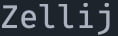
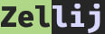
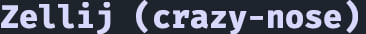
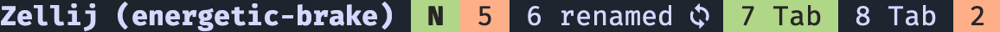
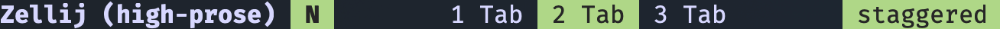

# tbar
Customizable navigation bar for Zellij.

## Instalation
To install it automatically you can run:

`bash <(curl "https://raw.githubusercontent.com/kotlw/tbar/main/build.sh") -d
`

You can install it manualy following next steps:

- `mkdir -p ~/.config/zellij/plugins/`
- `git clone https://github.com/kotlw/tbar/tree/main ~/.config/zellij/plugins/tbar`
- `cd ~/.config/zellij/plugins/tbar`
- `cargo build`
- `mv ./target/wasm32-wasi/release/tbar.wasm ~/.config/zellij/plugins/`


## Usage
`cd ~/.config/zellij/plugins/tbar && ./build.sh -c <config_name>` - apply config and rebuild plugin

### Custom layout
To create custom layout you can make a copy of ./configs/_template.rs and change it whatever you want. Plugin have a set of predefined components which you can use. Each of components has corresponding token described below.
___
#### Text
You can use any static text in the layot, as well as in any specific layouts _(tabs, mode, swap)_. Everything could be a text except `#` special symbol escaping of which is not supported. Also it could be used to add custom spacing between components.
##### Example
```rust
impl<'a> Default for Config<'a> {
    fn default() -> Config<'a> {
        Config {
            layout: "Zellij"
            ...
        }
    }
}
```
Output: 
___

#### Style `#[<style>,...]`
Style component allows you to customize other components. You can apply several styles simultaneously using next syntax `#[bold,fg:green,bg:black]`. When style is applied it affects all next components in the layout, so you can use `#[default]` to drop it.
##### Example
```rust
impl<'a> Default for Config<'a> {
    fn default() -> Config<'a> {
        Config {
            layout: "#[bold,bg:green,fg:black]Zel#[bg:black,fg:white]lij"
            ...
        }
    }
}
```
Output: 
##### Styles
- `fg:<color>` - foreground color
- `bg:<color>` - background color
- `bold` - bold text
- `default` - reset all styles
##### Colors
All of colors values are defined in zellij theme settings.
- `black`
- `red`
- `green`
- `yellow`
- `blue`
- `magenta`
- `cyan`
- `white`
- `orange`
- `gray`
- `purple`
- `gold`
- `silver`
- `pink`
- `brown`
___

#### Session `#S`
Just showing the session name as a plain text.
##### Example
```rust
impl<'a> Default for Config<'a> {
    fn default() -> Config<'a> {
        Config {
            layout: "#[bold,fg:white]Zellij (#S)"
            ...
        }
    }
}
```
Output: 
___

#### Mode `#M`
This is complex component. In config you need to fill `mode_layouts` map to define layout for each mode. You can use only Text and Style components to do it.
##### Example
```rust
impl<'a> Default for Config<'a> {
    fn default() -> Config<'a> {
        Config {
            layout: "#[bold,fg:white]Zellij (#S) #M"
            mode_layouts: HashMap::from([
                (InputMode::Normal, "#[bold,fg:black,bg:green] N #[default]"),
                (InputMode::Locked, "#[bold,fg:black,bg:red] L #[default]"),
                ...
            ])
            ...
        }
    }
}
```
Output:  
___

#### TabBar `#T`
This is complex component. In config you need to fill `tab_layouts` to define layout for different tab states. You can use Text Style and two more special components `#N` - for tab name and `#I` for tab index. When `#I` -  is used it changes default tab names from `Tab #1` to `Tab` to avoid index duplication. `LeftMoreTabs` and `RightMoreTabs` have a bit different behaviour: `#N` is not allowed and `#I` stands for number of collapsed tabs.
##### Example
```rust
impl<'a> Default for Config<'a> {
    fn default() -> Config<'a> {
        Config {
            layout: "#[bold,fg:white]Zellij (#S) #M#T"
            ...
            tab_layouts: HashMap::from([
                (TabPartState::Inactive, "#[fg:white] #I #N #[default]"),
                (TabPartState::Active, "#[bg:green,fg:black] #I #N #[default]"),
                (TabPartState::InactiveSync, "#[fg:white] #I #N 󰓦 #[default]"),
                (TabPartState::ActiveSync, "#[bg:green,fg:black] #I #N 󰓦 #[default]"),
                (TabPartState::LeftMoreTabs, "#[fg:black,bg:orange] #I #[default]"),
                (TabPartState::RightMoreTabs, "#[fg:black,bg:orange] #I #[default]"),
            ]),
            ...
        }
    }
}
```
Output:  
___

#### Swap Layout `#L`
This component uses `#N` as swap layout name, styles and text are allowed.
##### Example
```rust
impl<'a> Default for Config<'a> {
    fn default() -> Config<'a> {
        Config {
            layout: "#[bold,fg:white]Zellij (#S) #M#T#L"
            ...
            swap_layouts: HashMap::from([
                (SwapLayoutState::NonDirty, "#[bg:green,fg:black] #N #[default]"),
                (SwapLayoutState::Dirty, "#[bg:white,fg:black] #N #[default]"),
            ])
        }
    }
}
```
Output: 

___
#### Spacer `#_`
This component add equal sized spaces. By default spacer will be added in the end of the layout to fill bar with color till the end of the terminal.
```rust
impl<'a> Default for Config<'a> {
    fn default() -> Config<'a> {
        Config {
            layout: "#[bold,fg:white]Zellij (#S) #M#_#T#_#L"
            ...
        }
    }
}
```
Output: 
___
